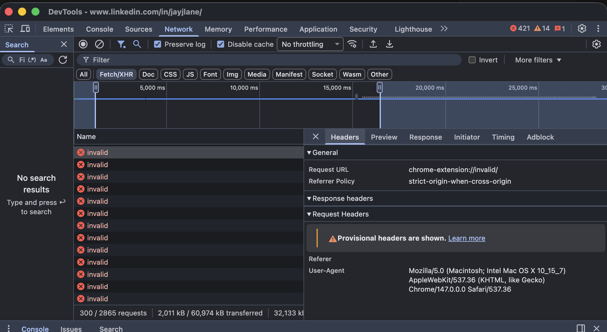
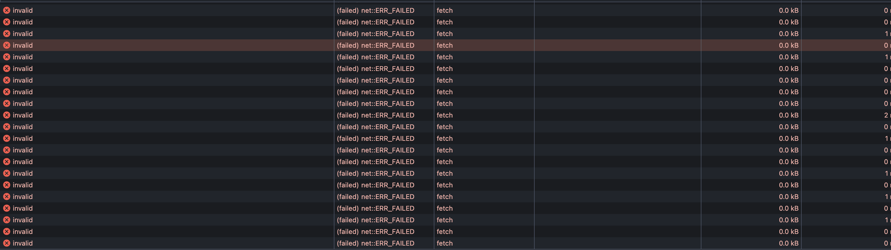

# LinkedIn extension-fingerprinting analysis

Source: `ceg6yuxj06s98drqjyvgw3yzi.js` — a 2.7 MB webpack chunk (`chunk.585.167fa9d3f6f67606cd3e.js`) loaded from `static.licdn.com` on every linkedin.com page.

This file is **not** a separately-injected script. It is one chunk of LinkedIn's main web client, served sitewide. The relevant module begins at module ID `9269` of webpack chunk `585`, with the active probe at line ~9571 of the deminified file.

## TL;DR — what it does

Two complementary techniques to enumerate which Chrome extensions a visitor has installed, plus a full classical browser fingerprint, all sent to LinkedIn's tracking pipeline.

### 1. Active probe — `AedEvent` (Anti-abuse Extension Detection)
- Iterates a hardcoded list of **6,236 entries** (**6,222 unique** Chrome extension IDs — the bundle contains 14 duplicate entries), each paired with a known-public file from that extension's `web_accessible_resources` manifest declaration.
- For each pair, calls `fetch("chrome-extension://<id>/<file>")`.
- Under Manifest V3 the fetch only succeeds if the extension is installed *and* the file is exposed — so a successful response confirms installation.
- Successes are POSTed to LinkedIn's tracking endpoint as event `AedEvent` with `browserExtensionIds: [...]`.
- Has a `staggerDetectionMs` mode that spaces probes out, and a `requestIdleCallback` mode that hides the work in idle frames.

### 2. Passive scan — `SpectroscopyEvent`
- Recursively walks the entire DOM — every text node, every attribute on every element — looking for any string containing `chrome-extension://`.
- Many extensions inject icon URLs, iframes, content-script artefacts, or `data-*` attributes that contain their own ID. This catches them passively, including extensions **not on the hardcoded list**.
- Emitted as event `SpectroscopyEvent` with `browserExtensionIds: [...]`.

### 3. Surrounding `AbuseFeaturesCollectionCoordinator` (same module)
The extension probes ride alongside a full device-fingerprint collection that gathers:

- `userAgent`, `appName/Version/CodeName`, `navigator.platform`, `cpuClass`, `hardwareConcurrency`, `deviceMemory`, `doNotTrack`, `webdriver`
- screen w/h, avail w/h, `colorDepth`, `pixelDepth`, `devicePixelRatio`, `screen.orientation`
- `navigator.language` (and userLanguage/browserLanguage/systemLanguage), `Intl` timezone, `Date().getTimezoneOffset()`
- `navigator.getBattery()` → `{charging, level, chargingTime, dischargingTime}`
- `navigator.connection` → `{saveData, effectiveType, rtt, downlink, downlinkMax, type}`
- touch support → `{touchStart, touchEvent, maxTouchPoints}`
- `navigator.mediaDevices.enumerateDevices()` → labels of every camera, microphone and speaker
- WebRTC ICE-candidate probe
- canvas fingerprint (`canvasHash`, `canvasWinding`)
- WebGL fingerprint — renderer, vendor, antialiasing, ~30 shader-precision parameters
- AudioContext fingerprint (sum of samples 4500–5000 of an OfflineAudioContext render)
- enumerated font list + `fontsHash`
- `navigator.plugins`
- spoofing/consistency checks: `liedOS`, `liedBrowser`, `liedResolution`, `liedLanguages`, `adBlockInstalled`
- storage availability: `sessionStorage`, `localStorage`, `indexedDB`, `openDatabase`, `addBehavior`
- the PerimeterX (HUMAN Security) bot-defense cookies `_px3`, `_pxhd`, `_pxvid`, `pxcts` are read and re-emitted

Everything is LZ-string compressed and base64'd via the bundle's `compressToBase64`, then encoded by `encodeDNA` / `encodeDFPIos` / `encodeDFPAndroid` before being shipped through `globalThis.triggerApfc` / `globalThis.triggerDnaApfcEventOnDemandVersioned` to LinkedIn's standard Voyager tracking endpoint.

## Files in this folder

| file | what it is |
|---|---|
| [`deobfuscated-extension-detection.js`](deobfuscated-extension-detection.js) | The two extension-detection functions + DOM walker, fully renamed and beautified, ready to read or quote. |
| [`probed-extension-ids.txt`](probed-extension-ids.txt) | All 6,222 unique extension IDs from the hardcoded probe list, one per line, sorted. Look any of them up at `https://chromewebstore.google.com/detail/<id>`. |
| [`screenshots/`](screenshots/) | DevTools captures showing the probes firing on a real linkedin.com pageview. |
| [`scripts/re-extract.sh`](scripts/re-extract.sh) | Regenerates `probed-extension-ids.txt` from a freshly-downloaded chunk. Use this to track changes across LinkedIn deploys. |
| [`CHANGELOG.md`](CHANGELOG.md) | Per-capture record of the bundle hash, probe count, and any changes. PRs welcome with newer captures. |
| `README.md` | This file. |

## Observed in the wild

While trying to get a resized version of my LinkedIn profile image (`linkedin.com/in/jayjlane.png?size=100`) I hit an error and went back to my main profile page  with DevTools open, the Network panel fills with thousands of failed `chrome-extension://invalid/` fetches in two bursts (one near page-load, one a few seconds later — corresponding to the two code paths in `fireExtensionDetectedEvents`, the eager call and the `requestIdleCallback`/route-change re-fire).

Thinking that one of my extensions weren't playing nice I disabled the usual suspects UBlockOrigin, Obsidian Web Clipper, React Dev Tools, and it was still occurring. I went scorched earth and disabled all my extensions to no avail causing me to look deeper.

The detail view of any single row shows it was a `fetch` that failed with `net::ERR_FAILED` — the diagnostic Chrome returns when a `chrome-extension://` URL targets an extension that isn't installed:

Important presentation detail: Chrome's DevTools rewrites the displayed URL to **`chrome-extension://invalid/`** when the target extension isn't installed. This is a Chrome-side privacy mitigation — it deliberately hides which extension ID was probed so a screenshot can't leak the probe list. The real fetches go to `chrome-extension://<actual-id>/<file>` for each of the 6,222 unique IDs in [`probed-extension-ids.txt`](probed-extension-ids.txt).

In one captured session: **300 of the 2,865 visible network requests on a single profile pageview were extension probes** (scrolled view, the actual count is in the thousands — there is one fetch per probed ID).

## Reproducing the find yourself

1. Open linkedin.com in Chrome with DevTools open.
2. **Network** tab → Fetch/XHR filter. Reload. You will see thousands of red `chrome-extension://invalid/` rows — one per probed extension that you don't have installed.
3. To see the source: **Network** tab → search `chunk.585` → open the response → search for `chrome-extension://`. You will land in the same module.
4. Or, in the **Sources** panel, set an XHR/fetch breakpoint on the substring `chrome-extension://`. Reload; you will hit the breakpoint inside `fetchExtensions` once for each probe.
5. To watch the exfil event: **Network** tab → filter `li/track`, look for the POST whose body decodes to an `AedEvent` containing `browserExtensionIds`.

## Caveats / fairness

- The module name is `AbuseFeaturesCollectionCoordinator`. LinkedIn's framing internally is anti-fraud / anti-scraping rather than ad-targeting. That said, "anti-abuse" telemetry that fingerprints every visitor and enumerates 6,236 specific extensions is still extension-fingerprinting, regardless of intent.
- The fetch trick relies on Manifest V3 `web_accessible_resources`. Extension authors who don't declare any web-accessible files are not detectable by technique #1; they may still be detectable by technique #2 if they inject anything into the DOM.
- The probe only fires in Chromium (`navigator.userAgent` contains `"Chrome"`). Firefox and Safari users are not probed by this module.
- The PerimeterX cookies are PerimeterX's, not LinkedIn's; they are observed here, not minted here.
- This analysis is a snapshot. The chunk hash (`167fa9d3f6f67606cd3e`) and the probed-ID list change across deploys.

## License of analysis

The deobfuscated file in this folder is a clean-room renaming of LinkedIn's minified output for the purpose of security research and public-interest commentary. The original code is © LinkedIn / Microsoft.
